# apiface (一套由java开发的接口文档工具)
###### Tools that run in an operational or development environment

### 演示地址
* 演示地址: <a href="https://dayeshing.github.io/apiface/apiface.html" target="_blank">apiface</a>


### 开发环境
> * nodejs
> * yarn
> * maven
> * jdk8


* ### 开发初衷
```markdown
市面上的接口文档琳琅满目，但是要找到一个适合自己的接口文档确实有点难度，诸如传统的api文档上有一下几方面的问题。
 * 1.文档更新慢，造成占用团队协作时间太多
 * 2.传统javadoc太老了，不符合现在发展趋势
 * 3.不支持用例测试，给接口对接和测试麻烦
 * 4.写多余的注释和文档，(既要写接口文档还要写代码注释)不能空出太多时间给开发者
 * 5.文档工具对代码具有入侵性，如swagger
 * 6.单一前端仅仅能访问单一后端，不能单一前端访问不同后端获取不同后端的接口文档
 * 7.接口文档和实际的接口版本不一致时，还要维护一套接口文档
正是如此apiface的产生是为了针对上述的诸多问题，如果您对apiface感兴趣，可以深入看下代码，apiface还会继续完善的
```

* ### apiface的特点
```markdown
 * 1.基于javadoc，但不会飘离项目本身的依赖
 * 2.基于maven(gradle)插件不会存在任何形式的代码入侵，不给您的代码带来耦合
 * 3.前端只需部署一套就能访问不同的后端接口并展示其文档接口
 * 4.仅仅需要根据实际接口写符合要求的javadoc,不用写任何的其他代码
 * 5.前端获取接口文档不依赖于后端运行环境(接口测试用例需要后端给真实的数据)
 * 6.兼容swagger2接口文档，如果您的项目依赖swagger接口文档，想换一套前端UI，可以使用apiface
 * 7.理论上支持一切由java语言开发的web应用
```

* ### apiface与swagger2的比较
```markdown
 * 1.运行环境：
    (1).apiface:即可可以单独部署不占用实际项目本身的资源，又可以和实际项目捆绑部署(需要将生成的api.json和前端编译生成dist下的文件部署到应用服务)
    (2).swagger2：仅仅能捆绑部署，不能分离部署（占用资源外，在实际生产环境还要重新打包，添加额外的麻烦）
    (3).结果:apiface 比较好
 * 2.访问权限：
    (1).apiface:支持，但比较麻烦。 单独部署时，可以将生成的api.json文件放入应用的授权访问资源中， 集成部署时将生成的文件放入应用的授权访问资源中(api.json和前端编译生成dist下的文件)
    (2).swagger2：支持，无操作，全在于应用的实际权限
    (3).结果:swagger2 比较好
 * 3.代码环境：
    (1).apiface: 使用项目不依赖apiface的包，仅仅需要写javadoc，对代码没有任何入侵性（即使apiface存在缺陷，也影响不到项目的代码），下一阶段支持泛型
    (2).swagger2：使用项目依赖swagger2的包，又要写javadoc将必要的注释和想法表达外，还要添加一系列多余的标记类，对代码具有入侵性，不支持泛型
    (3).结果:apiface 比较好
 * 4.全面性：
    (1).apiface: 使用的类加载器：项目编译时编译项目的类加载器，总有一些你想不到的接口文档展示不太友好
    (2).swagger2：使用的类加载器：项目运行的类加载器，支持全面
    (3).结果:swagger2 比较好（毕竟swagger2 搞了很多年了）
 * 5.使用条件：
    (1).apiface: 必须用maven或gradle(下一阶段支持)编译
    (2).swagger2：引入相关的包
    (3).结果:apiface、swagger2各有有优势
 * 6.界面UI:
    (1).apiface: 单页面，支持搜索接口，接口展示较合理，操作简单，axios请求
    (2).swagger2：单页面，不支持搜索接口（接口多的时候抓瞎），接口展示不合理，操作复杂，curl请求
    (3).结果:apiface 比较好
 * 7.界面兼容性：
    (1).apiface: 页面完全兼容swagger2的
    (2).swagger2：理论上可以用swagger2界面展示apiface的接口，但是一般人不会这么做，除非脑袋被驴踢了
    (3).结果:apiface 比较好
 * 8.综上所诉，我认为apiface不对项目本身存在任何形式的代码入侵，难能可贵，但局限于编译的时候，所以用相同编译插件的时候可以考虑apiface，
    如果您的项目现在使用swagger2,想换一个，也可考虑apiface,因为apiface支持swagger2的页面
```


* ### apiface的模块说明
> * apiface-core apiface的核心代码
> * apiface-example apiface的使用范例
> * apiface-proxy  apiface （文档项目分离）访问后端的代理，解决cookie跨域
> * apiface-font apiface的前端代码
> * apiface-maven-plugin  apiface 文档生成的插件，基于maven生命周期

* ### apiface-core的实现原理与使用方式(apiface的核心实现)
##### api的生成流程
```flow
st=>start: 开始
readSource=>inputoutput: 使用 JavaParser 将java源代码的文本解析为一棵CompilationUnit类型的树
createDoc=>inputoutput: 将CompilationUnit类型树解析成对应的文档JSON
writeDoc=>inputoutput: 写出文档JSON
readDoc=>inputoutput: 读取文档JSON
vaildDoc=>condition: 校验文档JSON
isApi=>inputoutput: 将文档JSON加入api行列
isNotApi=>inputoutput: 文档JSON不符合需求，不做处理
transformApi=>condition: 是否将Api转换成类一种JSON文本
isTransformApi=>inputoutput: 将Api转换成类一种JSON文本,需要实现接口
isNotTransformApi=>inputoutput: 不做处理
writeApis=>inputoutput: 写出APIs JSON文档
e=>end: 结束

st->readSource->createDoc->writeDoc->readDoc->vaildDoc
vaildDoc(no)->isNotApi->transformApi
vaildDoc(yes)->isApi->transformApi
transformApi(no)->isNotTransformApi->writeApis
transformApi(yes)->isTransformApi->writeApis
writeApis->e
```

##### <a id="javadocs">apiface的javadoc标记规范</a>
|标记|含义|格式|作用域|生效条件|描述|
|:------:|:------:|:------|:------| :------| :------|
|@ignore|忽略注释标记|@ignore|class,method,feild|所有文档注释|标记该注释不是文档对象不做处理|
|@author|开发者信息标记|@author username|class,method|所有文档注释|标记该类或方法作者信息|
|@author|开发者信息标记|@author username丨email|class,method|所有文档注释|标记该类或方法作者信息|
|@since|版本标记|@since version|class,method|所有文档注释|标明一个类，方法，或其它标识符是在哪个特定版本开始添加进来的|
|@action|接口类标记|@action group,group1|(abstract)class|无@ignore的文档注释|标记该注释类是一个接口类|
|@error|错误描述|@error 发送错误时的描述|method|含@action的文档注释|接口的错误描述|
|@error|时间|@error data-time|method|含@action的文档注释|接口的最后编辑时间|
|@hidden|隐藏标记|@hidden|class,method|含@action的文档注释|标记该注释中接口类或接口仅仅是一个被继承类引用的文档|
|@pack|使用统一包装|@pack 类全名<T>|class|含@action的文档注释|通常用于指定返回全局包装格式，其中包装类必须是有且仅有一个泛型|
|@unpack|不使用统一包装|@unpack|class,method|含@action的文档注释|标记具体接口不使用全局包装|
|@uri|标记资源uri|@uri /uri|class,method|含@action的文档注释|springmvc可忽略，标记具体接口使用的uri|
|@summary|标记摘要|@summary 摘要|method|含@action的文档注释|接口简短的描述|
|@method|标记请求方法|@method get,post|class,method|含@action的文档注释|springmvc可忽略，标记具体接口使用的请求方法|
|@produce|标记请求context类型|@produce text/html,text/xml|class,method|含@action的文档注释|springmvc可忽略，标记具体接口使用的请求内容|
|@consume|标记响应context类型|@consume text/html,text/xml|class,method|含@action的文档注释|springmvc可忽略，标记具体接口使用的响应内容|
|@exclude|接口排除参数|@exclude param1,param2|method|含@action的文档注释|标记具体接口的参数是一个包装类，但有些不想展示的参数|
|@return|接口返回值|@return 类全名<T,V>丨描述|method|含@action的文档注释|标记具体接口的返回是一个包装类|
|@return|接口返回值|@return 类全名或基本类型|method|含@action的文档注释|标记具体接口的返回是一个包装类或者基本类(java的基本类型+string,date)|
|@return|接口返回值|@return int丨描述|method|含@action的文档注释|标记具体接口的返回是一个基本类，描述可以省略|
|@param|接口参数|@param 参数名|method|含@action的文档注释|标记具体接口的参数是为某名的基类|
|@param|接口参数|@param 参数名丨参数类型|method|含@action的文档注释|标记具体接口的参数是为某名的包装类（类全名）或者基本类|
|@param|接口参数|@param 参数名丨参数类型丨描述|method|含@action的文档注释|标记具体接口的参数，带描述|
|@param|接口参数|@param 参数名丨参数类型丨必须丨描述|method|含@action的文档注释|标记具体接口的参数，带参数限制|
|@param|接口参数|@param 参数名丨参数类型丨必须丨默认值丨描述|method|含@action的文档注释|标记具体接口的参数，带默认值|
|@param|接口参数|@param 参数名丨参数类型丨必须丨默认值丨类型 body/form/path丨描述|method|含@action的文档注释|标记具体接口的参数，带类型|
|@model|模型类标记|@model onlyname|(abstract)class,interface|无@ignore的文档注释|标记该注释类是一个模型类|
|@hidden|隐藏标记|@hidden|(get)method,feild|含@model的文档注释|标记该注释中模型类中属性字段是否展示|
|@required|是否必须|@required|feild|含@model的文档注释|标记该注释中模型类中属性字段是否必须|
|@example|隐藏标记|@example 默认值|(get)method,feild|含@model的文档注释|标记该注释中模型类中属性字段默认值|
##### <a id="javadocUsing">apiface的javadoc标记实际使用详解</a>
注： 详看[apiface-example](./apiface-example/src/main/java/com/daysh/apiface)文件中用法


* ### apiface-font的使用方式(apiface前后端接口交互方案(前端界面))

#### 安装&运行&打包
> * yarn                  -- 安装依赖
> * yarn dev              -- 运行前端环境
> * yarn build            -- 打包

#### 特点
> * 1.界面完全兼容swagger2界面
> * 2.支持多后台接口方案(一套界面搞定若干个系统的API展示)
> * 3.支持apiface无入侵api接口方案(一个自定义的API接口展示方案)
> * 4.支持i18n，国际化
> * 5.支持生成本地文档 markdown形式
> * 6.动态前端配置(不需要再打包apiface-font 仅仅需要配置conf.json)

#### 依赖
> * "axios": "^0.16.2"
> * "element-ui": "^2.13.0"
> * "font-awesome": "^4.7.0"
> * "mavon-editor": "^2.9.0"
> * "vue": "^2.5.9"
> * "vue-i18n": "^8.20.0"
> * "vue-json-viewer": "^2.2.14"

#### 模式说明（前端动态配置）
|属性名|含义|类型|生效条件|描述|
|:------:|:------:|:------|:------| :------|
|mode|模式选择|字符串，枚举值|当值为single或dev|single意味着访问docs[]中的分组接口可以单独部署，而dev 则是集成部署就行swagger一样放在代码后端代码中|
|api|接口文档地址|字符串，任意值|mode值为dev时|在集成部署中有效并指向接口访问地址 eq:proxy/apifaces/api-docs（其中proxy为base uri  apifaces/api-docs 为实际接口）|
|title|接口网页标题|字符串，任意值|title不为空时|为方便使用者定义自己的标题，优先等级大于默认|
|proxy|使用代理地址|字符串，任意值|mode值为single，并且proxy不为空时|指向代理服务器-配合apiface-proxy使用，eq:http://ip:port/proxy/agent/api,用于访问多套API接口时解决跨域问题|
|docs|动态接口配置|数组|mode值为single|为下拉选项的API接口选项提供候选值|
|group|接口分组名称|字符串，任意值|跟随docs|用于显示接口分组名称|
|options|接口地址包装|数组|跟随docs|将一个接口地址包装为接口显示名称的接口地址|
|name|接口显示名称|字符串，任意值|跟随options|用于显示接口显示名称|
|addr|接口地址|字符串，url|跟随options|用于显示接口地址以及获取描述文档的依据|

注： 在[conf.json](./apiface-font/static/conf.json)文件中配置

#### 演示
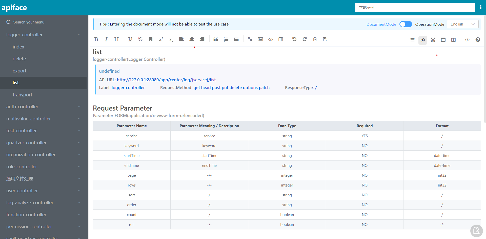
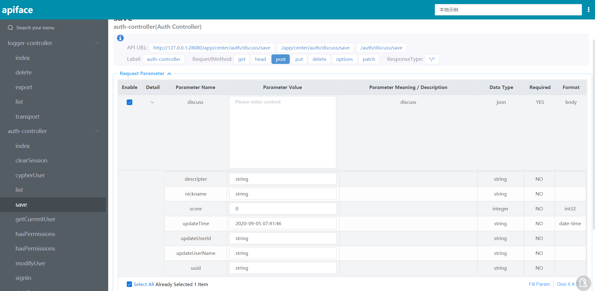
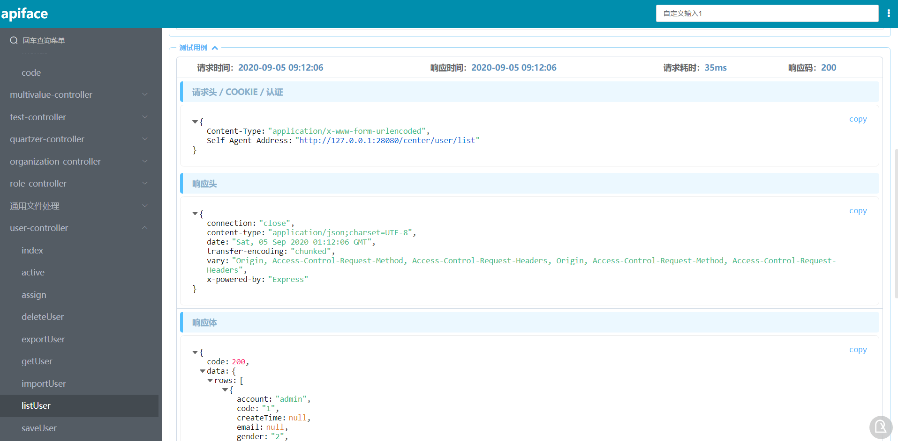
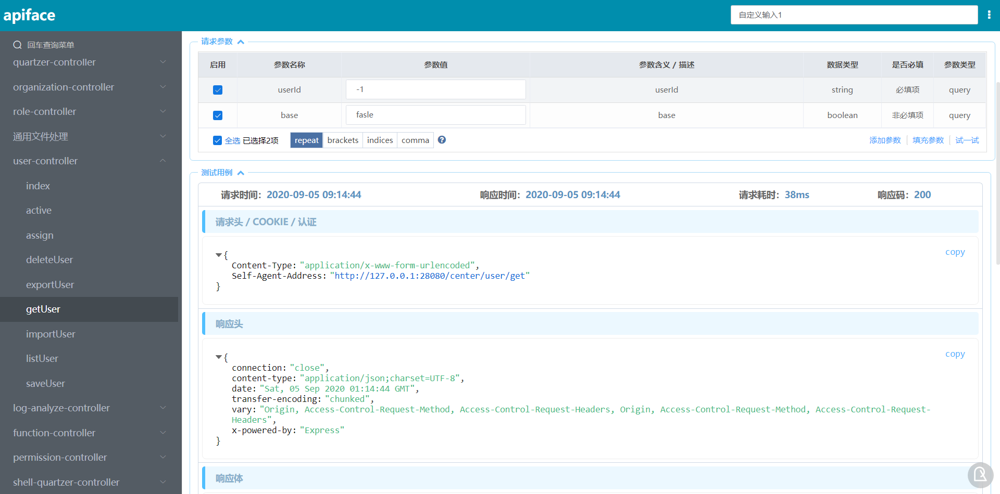
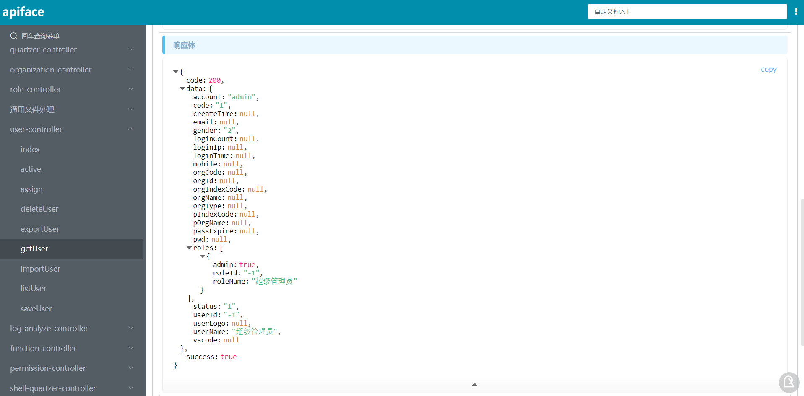
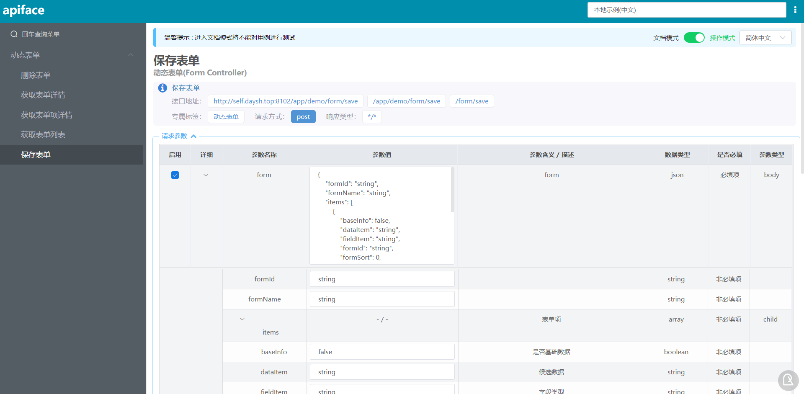
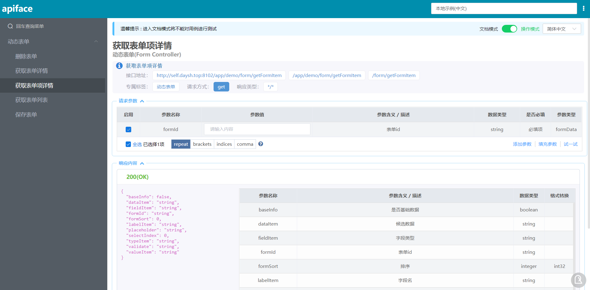
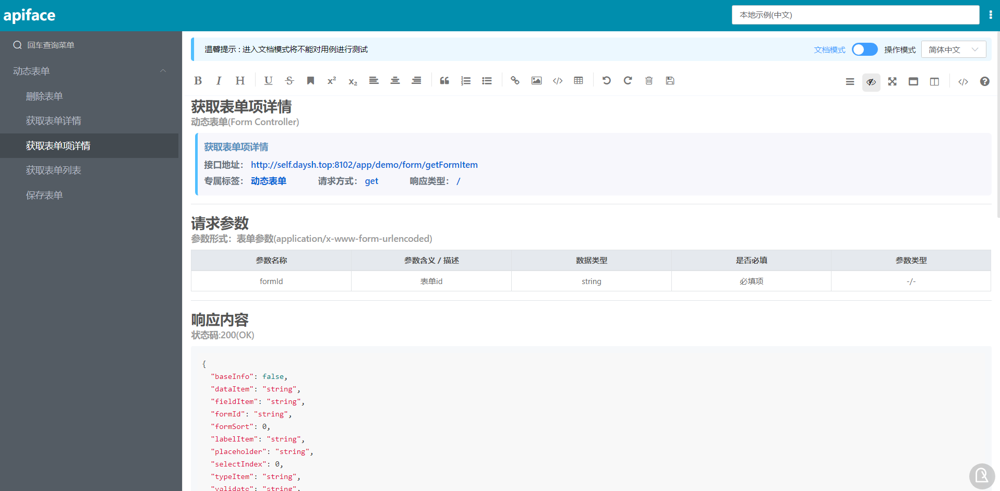
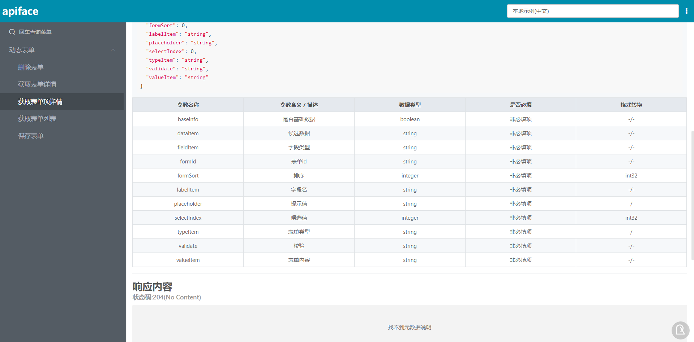
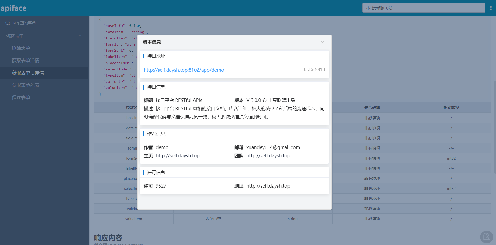
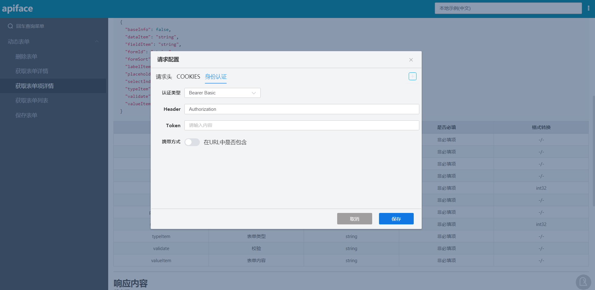


* ### apiface-proxy使用方式
##### 部署步骤
 * 将使用apiface-maven-plugin生成api.json放入[static](./apiface-proxy/src/main/webapp/static)文件夹内
 * 将编译apiface-font生成[dist](./apiface-font/dist)文件夹内的所有文件放入[static](./apiface-proxy/src/main/webapp/static)文件夹内
 * 按需修改apiface-proxy中的[conf.json](./apiface-proxy/src/main/webapp/static/conf.json)
 * 编译打包apiface-proxy成war包
 * 部署war包并访问
 
注：上述过程maven都已经帮我们做好了，您只需要安装好环境 并执行mvn package命令即可

* ### apiface-maven-plugin的使用方式（apiface的maven插件生成APIs接口文档）
##### <a id="apifaceMavenPlugin">apiface-maven-plugin参数</a>
> * host          打包生成的接口文档指向 该项目部署的测试服务器，用于用例测试
> * basePath      相当于 HttpServletRequest.getContextPath()，部署项目的实际baseUrl用于用例测试
> * license       
> * licenseUrl    
> * developer    开发团队|开发团队联系 ，用于显示开发者信息
> * url          开发团队主页
> * description  该接口平台的描述信息
> * version      该接口平台记录的项目的版本
> * title        该接口平台的标题
> * artifactId   生成接口文档的项目的 artifactId （必填，不填无法生成接口文档）

##### <a id="apifaceMavenPluginUsing">apiface-maven-plugin使用方式</a>
```xml
<plugin>
    <groupId>com.daysh.apiface</groupId>
    <artifactId>apiface-maven-plugin</artifactId>
    <version>1.0.0-SNAPSHOT</version>
    <configuration>
        <artifactId>apiface-example</artifactId>

        <host>127.0.0.1:28080</host>
        <basePath>/app</basePath>
        <license>9526</license>
        <licenseUrl>http://self.daysh.top</licenseUrl>
        <url>http://self.daysh.top</url>
        <developer>Daye Shing|xuandeyu14@gmail.com</developer>
        <description>apiface让您的接口文档更丰富、更优雅</description>
        <version>${project.version}</version>
        <title>接口文档 APIs</title>
    </configuration>
    <executions>
        <execution>
            <id>apiface</id>
            <phase>package</phase>
            <goals>
                <goal>doc</goal>
                <goal>api</goal>
            </goals>
        </execution>
    </executions>
</plugin>
```


* ### apiface-example使用方式(apiface的使用实例demo)
##### 使用方式
`
在使用之前，您需要部署 apiface-font 前端文件到服务器，或者直接部署apiface-proxy到servlet容器并运行，
然后使用apiface-maven-plugin maven的api生成文档并部署器api.json到服务器
然后在apiface-example中的包com.daysh.apiface.boot下有各类环境的运行程序，运行就能看到实际的测试用例
apiface-example 的目的仅仅是用户测试用例以及使用演示
`


* ### idea使用live template生成您的注释(简化您编写javadoc的操作)
##### 定义template
* 生成类的时候File Header
```java
/**
 * ${NAME}的描述
 * @author Daye Shing | 896379914@qq.com
 * @ignore
 * @since 1.0
 * @date ${YEAR}-${MONTH}-${DAY} ${HOUR}:${MINUTE}
 */
```
* 生成普通类的时候 定义 Abbreviation： /**c
```java
/**
 * $name$的描述
 * @author Daye Shing | 896379914@qq.com
 * @since 1.0
 * @ignore
 * @date $date$ $time$
 */
```
* 生成action类的时候 定义 Abbreviation： /api
```java
/**
 * $name$的接口类描述
 * @action 分组名称
 * @uri uri
 * @author Daye Shing | 896379914@qq.com
 * @since 1.0
 * @date $date$ $time$
 */
```
* 生成model类的时候 定义 Abbreviation： /mod
```java
/**
 * $name$的包装类描述
 * @model 唯一显示名称
 * @author Daye Shing | 896379914@qq.com
 * @since 1.0
 * @date $date$ $time$
 */
```
* 生成接口方法的时候 定义 Abbreviation： /***
```java
// 空一行
/**
 * 详细描述$params$
 * @uri uri
 * @summary 摘要
 * @method post,get
 * @ignore
 * @exclude 排除参数1,排除参数2
 * @error 错误描述
 * @return $returns$|描述
 * @author Daye Shing | 896379914@qq.com
 * @since 1.0
 * @date $date$ $time$
 */
```
注：$params$的值为
```groovy
groovyScript("def result=''; def params=\"${_1}\".replaceAll('[\\\\[|\\\\]|\\\\s]', '').split(',').toList();for(i = 0; i < params.size(); i++) {result+=('' == params[i])? '' : ' \\n * @param ' + params[i] + ' |参数类型|必须|默认值|参数类型 body/form/path|参数描述'}; return result", methodParameters())
```
##### 使用template
```
/api 或者 /mod 或者 /**c(回车)
public class Template{
    public String text(String name){/***(回车)
        return "";
    }
}
```

注：
* javadoc的使用详情参见 <a href="#javadocs">apiface的javadoc标记规范</a>和<a href="#javadocUsing">apiface的javadoc标记实际使用详解</a>
* apiface-maven-plugin的使用详情参见 <a href="#apifaceMavenPluginUsing">apiface-maven-plugin使用方式</a>和<a href="#apifaceMavenPlugin">apiface-maven-plugin参数</a>
